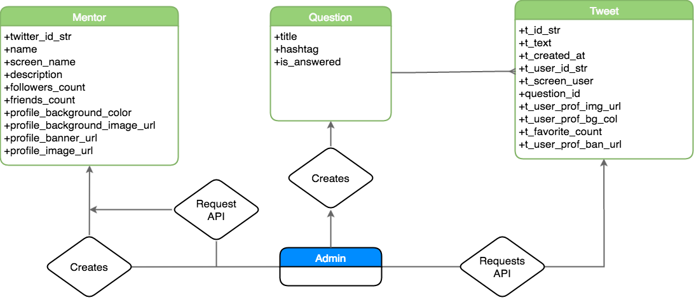

# DevMentor

Heroku link: [http://devmentor.herokuapp.com/](http://devmentor.herokuapp.com/)
Github link: [https://github.com/BinnyK/MentorSnippets](https://github.com/BinnyK/MentorSnippets)

## Rationale

This is the second major project for Coder Factory Academy. The aim of the project was to create an app that connects two groups, mentors and beginning developers. The project serves to solve these problems:

- Beginning devs have a lot of questions they would love to ask mentors.
- Beginning devs want to connect with mentors.
- Mentors want to connect with beginning devs
- Mentors don't have the time and resources to meet individually with many beginning devs.
- Mentors are busy people

## What is Dev Mentor?

**Dev Mentor** provides Mentor answers to the most popular questions asked by beginning developers. Questions such as:

  1. What is the most important soft skill that a beginning dev should have?
  2. What would do differently if you were beginning your tech career?
  3. How do I know when I'm ready to get a job as a dev?
  4. What are your top 3 dev workflow tools?

**Dev Mentor** is like code snippets but for advice

## Aim

To connect tech industry leaders (who have a wealth of knowledge and experience) to beginning developers (who would benefit from advice)

## Problems

Tech leaders (mentors) are busy people and don't necessarily have the time to connect individually with many beginning devs. They also (usually) don't have time to learn and use another new app with accounts and passwords to keep track of.

## Solution

In order to meet the problems, Dev Mentor uses Twitter. This helps because:

  1. Tech leaders are already on Twitter.
  2. Tech adivse can be kept short and concise (140 character limit), rather than having to write an essay to answer a simple question.
  3. Mentor advise is applicable to a large audience of junior devs.
  4. Mentors benefit from more followers.

## Roadblocks

The biggest challenge for this project was making sure that both parties benefited from this app. Dev Mentor a second attempt at this project. The first project was not sustainable as it required heavy time investment from Mentors.

Dev Mentor aims to solve that problem by using services that mentors already use.

## Wireframes

## User stories

[Trello board](https://trello.com/b/NuJasHA4/dev-mentor)

## Entity Relationship Diagram

