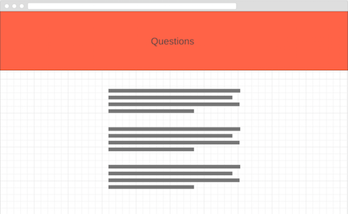

# DevMentor

A collection of advice from tech industry leaders.

Heroku link: [http://devmentor.herokuapp.com/](http://devmentor.herokuapp.com/)
Github link: [https://github.com/BinnyK/MentorSnippets](https://github.com/BinnyK/MentorSnippets)

Overview
========

* [Project brief](#project-brief)
* [Technology stack](#technology-stack)
* [Problem](#problem)
* [Solution](#solution)
* [User stories](#user-stories)
* [Concept, Design & Build](#concept-design-build)
* [Database schema design](#database-schema-design)
* [Gems and Tools used](#gems-and-tools-used)
* [Style guide](#style-guide)
  * [Color](#color)
  * [Font type](#font-type)
* [Project management in Trello](#project-management-in-trello)
* [Outstanding issues](#outstanding-issues)

Project brief
=============

* Design, build and deploy an application that brings two groups of people together
* Find a problem that can be solved with a solution

[Return to overview](#overview)

Technology stack
========

Ruby on Rails
Bootstrap

Planning done through [Trello](https://trello.com/b/NuJasHA4/dev-mentor)

[Return to overview](#overview)

Problem
=======

* Beginning devs have a lot of questions they would love to ask mentors.
* Beginning devs want to connect with mentors.

* Mentors want to connect with beginning devs
* Mentors don't have the time and resources to meet individually with many beginning devs.
* Mentors are busy people

[Return to overview](#overview)

Solution
========

* Use Twitter to connect popular dev questions to tech leaders
* Collate and display all responses on DevMentor.

Rationale

  1. Tech leaders are already on Twitter.
  2. Tech adivse can be kept short and concise (140 character limit), rather than having to write an essay to answer a simple question.
  3. Mentor advise is applicable to a large audience of junior devs.
  4. Mentors benefit from more followers.

**Dev Mentor** provides Mentor answers to the most popular questions asked by beginning developers. Questions such as:

1. What is the most important soft skill that a beginning dev should have?
2. What would do differently if you were beginning your tech career?
3. How do I know when I'm ready to get a job as a dev?
4. What are your top 3 dev workflow tools?

[Return to overview](#overview)

User stories
============

Junior Dev
-----------
1. As a newbie, I want to be able to see a list of questions so that I can see answers from mentors.
2. As a newbie, I want to be able to see a collection of different mentors' (tweet) advice under a specific question so that I can see a range of answers
3. As a newbie, I want to see a list of mentors so that I can see who are giving the advice
4. As a newbie, I can see a mentor's social media links so that I can continue the discourse and connect with them.
4. As a newbie, I can log in with my Twitter account so that I don't have to create another new account for this website.

Admin
----------

1. As an admin, I can add the screen name of a mentor into the mentor list so that I can add mentors to the app.
2. As an admin, I can fetch the latest details about a mentor using the mentor's screen name and the Twitter API so that I can keep the mentor's information current.
3. As an admin I can fetch the tweets that belong to a particular qestion's hashtag so that I can display it on the question page.
4. As ad admin, I can fetch and update the tweets that belong to a particular question so that I can keep the answers up to date.
5. As an admin, I have access to an admin panel so that I can edit and delete all models.

[Return to overview](#overview)

Concept, Design and build
=========================

Concept
-------

The starting point for DevMentor began with thinking through why mentors and students would use the app.

Design
------

Next simple wireframes to show what the pages of the app would show.

Mentor list page

Question list page

Tweet answers page

Build (MVP)
-----

Next the final mvp design.

Mentor list page

Question list page

Tweet answers page

Database schema design
===================================

Gems and Tools used
===========================================
* [Devise](https://github.com/plataformatec/devise)
* [Twitter](https://github.com/sferik/twitter)
* [Pundit](https://github.com/elabs/pundit)
* [Rolify](https://github.com/RolifyCommunity/rolify)
* [Simple_form](https://github.com/plataformatec/simple_form)
* [Bootstrap-sass](https://github.com/twbs/bootstrap-sass)
* [Ransack](https://github.com/activerecord-hackery/ransack)
* [Active-admin](https://github.com/activeadmin/activeadmin)
* [Oauth Twitter](https://github.com/arunagw/omniauth-twitter)
* [heroku](https://www.heroku.com)
* [sketch](https://www.sketchapp.com)
* [trello](https://trello.com)

[Return to overview](#overview)

Style Guide
===========

CSS framework
-------------

I decided to use Bootstrap because:

1. To get a better understanding of Bootstrap in preparation for working in the industry.
2. To quickly build out an mvp using minimal styles.
3. Make use of templates available on the web.

Colour
----- 

Item | Colour | RGB | HEX  
---: | -----:| ---:| ---
Banner primary |  | (25,7,41) | #190729
Banner secondary |  | (51,122,183) | #337AB7
Button primary |  | (221,81,56) | #DD5138
Button Secondary |  | (240,173,78) | #F0AD4E
Font |  | (64,65,66) | #404142

Font type
----

Graphics
--------

I decided to go with using this little guy as the main logo for the project

Image used with attribution from [Vexels](https://www.vexels.com/vectors/preview/142153/friednly-happy-earth-day-cartoon)

Roadblocks
==========

DevMentor is the second attempt at solving this problem. The first attempt was trying to connect students and workers in every industry and every career path. The reason I decided to redo this project was because there was no buy-in or benefit for the worker.

This project aims to benefit the mentors as the primary goal (through status and followers on Twitter) while benefitting junior devs in the process.

